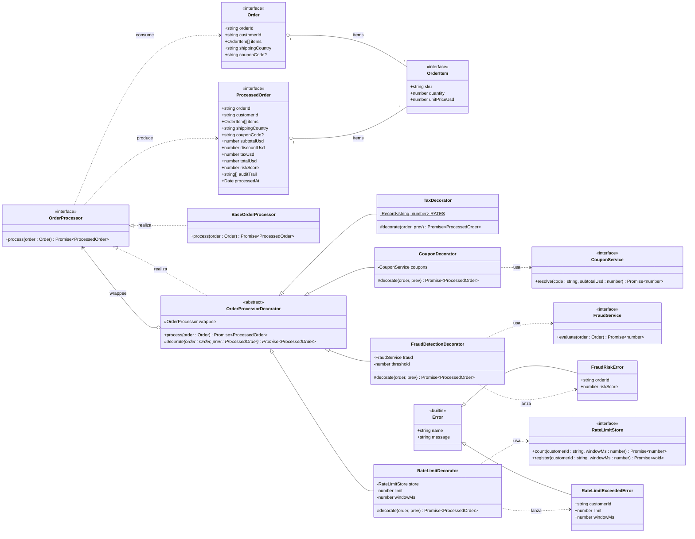
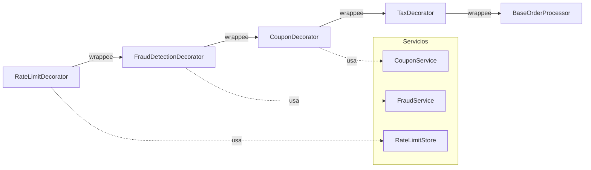
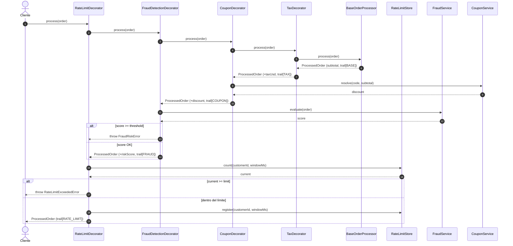

# Diagrama UML — Pipeline de procesamiento de órdenes (patrón Decorador)

Este diagrama modela las clases e interfaces definidas en `OrderPipeline.ts`.
Se respeta la nomenclatura UML:

- **Componente**: `OrderProcessor` (interfaz común a procesador base y decoradores).
- **Componente Concreto**: `BaseOrderProcessor` (implementación sin lógica adicional).
- **Decorador abstracto**: `OrderProcessorDecorator` (mantiene la referencia al componente envuelto).
- **Decoradores concretos**: `TaxDecorator`, `CouponDecorator`, `FraudDetectionDecorator`, `RateLimitDecorator`.
- **Servicios externos (dependencias inyectadas)**: `FraudService`, `CouponService`, `RateLimitStore`.
- **Errores personalizados**: `FraudRiskError`, `RateLimitExceededError`.

## Diagrama de clases



## Diagrama de composición concreta (resultado del factory `buildOrderPipeline`)

El factory construye, de afuera hacia adentro, la siguiente cadena:

```
RateLimit → FraudDetection → Coupon → Tax → Base
```



## Diagrama de secuencia (flujo de una orden válida)



## Notas de diseño

- **OCP (Open/Closed)**: para añadir una nueva responsabilidad (p. ej. `LoyaltyPointsDecorator`, `GiftWrapDecorator`) basta con crear una nueva subclase de `OrderProcessorDecorator` y componerla en el factory; no se modifica ningún decorador existente.
- **Inmutabilidad**: la utilidad privada `patch` reconstruye siempre un `ProcessedOrder` nuevo; nunca se muta el objeto recibido.
- **Resiliencia vs. fallo fuerte**:
  - Resiliente: `CouponDecorator` (captura el error del servicio y continúa con `discountUsd = 0`, dejando traza).
  - Fallo fuerte: `FraudDetectionDecorator` lanza `FraudRiskError` si el score supera el umbral; `RateLimitDecorator` lanza `RateLimitExceededError` si se excede el límite.
- **Testeabilidad aislada**: cada decorador puede probarse usando un _stub_ del `OrderProcessor` envuelto y _mocks_ de los servicios externos (`FraudService`, `CouponService`, `RateLimitStore`), sin requerir el resto del pipeline.
- **Orden de composición** en `buildOrderPipeline`: externos → internos = `RateLimit → FraudDetection → Coupon → Tax → Base`. El efecto en tiempo de ejecución es que `Base` se ejecuta primero (cálculo de subtotal) y `RateLimit` envuelve todo el pipeline, bloqueando órdenes abusivas antes de devolver al cliente.
